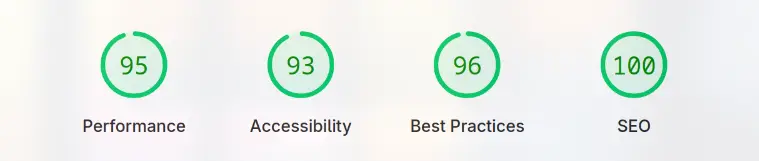

Verdant is a modern, full-stack e-commerce application built with a focus on performance, scalability and security.

## Features

-   **User Authentication:** Secure user registration, login, and session management.
-   **Product Catalog:** Browse and manage a wide range of products.
-   **Shopping Cart:** Add, remove, and manage items in your cart.
-   **Secure Checkout:** Seamless payment processing powered by Razorpay.
-   **RESTful API:** Well-documented API with Swagger for easy integration.

---

## Technologies

### Backend

-   **Runtime:** Bun (Node.js compatible)
-   **Framework:** Express.js
-   **Database:** MongoDB (Mongoose)
-   **Caching:** Redis
-   **Authentication:** JWT, bcrypt
-   **Payments:** Razorpay
-   **API Docs:** Swagger
-   Navigate here for [API Refrence](https://verdant.samthetechi.site/docs)

### Frontend

-   **Framework:** React.js
-   **Language:** TypeScript
-   **Build Tool:** Vite
-   **Styling:** Tailwind CSS
-   **State Management:** Redux Toolkit
-   **Animations:** Framer Motion


### Performance Stats



---

## Getting Started


### Live Link!

-   Just click [Here!](https://verdant.samthetechi.site)

### Using Docker Image


- Build and Run image:
    ```bash
    docker build -t verdant .
    docker run -d --env-file .env --network host --name verdant verdant
    ```
- Application should be availabe at  `http://localhost:5000` & Make sure to fill .env

### Mannual Setup


1.  Clone the repository:
    ```bash
    git clone https://github.com/your-username/verdant.git
    cd verdant
    ```
2.  **Backend Setup:**
    ```bash
    cd backend
    bun install # or npm install
    cp example.env .env # Configure your environment variables
    ```
3.  **Frontend Setup:**
    ```bash
    cd ../frontend
    bun install # or npm install
    ```
4.  **Start Backend:**
    ```bash
    cd backend
    bun dev # or npm run dev 
    ```
5.  **Start Frontend:**
    ```bash
    cd frontend
    bun dev # or npm run dev
    ```

The application should now be running on `http://localhost:5173` (frontend) and `http://localhost:5000` (backend API).

## License

This project is licensed under the **MIT License**. See the [LICENSE](LICENSE) file for details.

---

Made with ❤️ by [Sameer Gupta](https://github.com/SamTheTechi)

